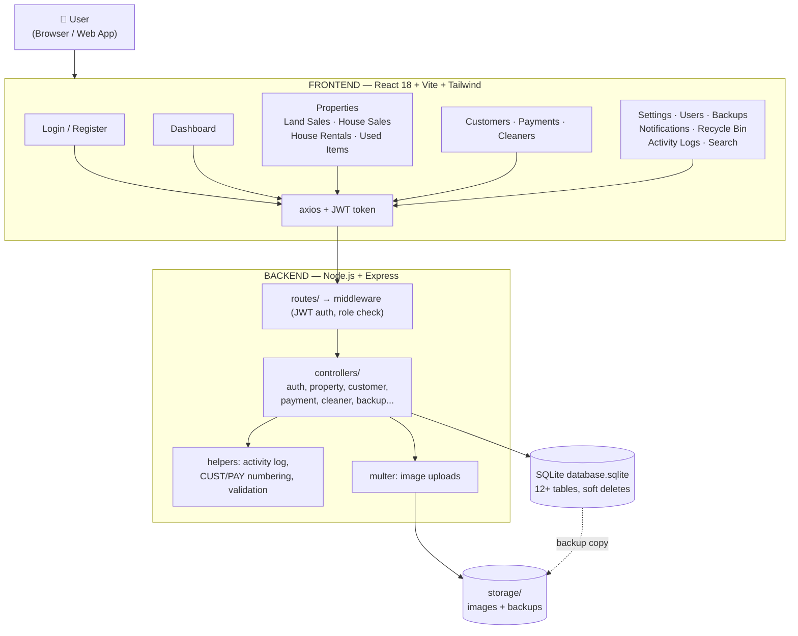

# NOTE: LAAS Real Estate — Architecture Note (sawir/diagram loo sameeyo)

Mashruuc: **LAAS Real Estate** — nidaam maamul guryaha iyo dhulka (properties, sales, rentals, payments).
Waa Laravel 12 app la bedelay: **React 18 + Node.js (Express) + SQLite**.

---

## 1. QAYBAHA GUUD (3 layer)

```
┌─────────────────────────────────────────────────────┐
│                  USER (Browser / Web App)            │
└──────────────────────────┬──────────────────────────┘
                           │ HTTP
┌──────────────────────────▼──────────────────────────┐
│   FRONTEND — React 18 + Vite + Tailwind CSS v4      │
│   (frontend/)                                       │
│   • Pages: Login, Dashboard, Properties, Customers… │
│   • JWT token kaydiya, axios wuxuu diraa /api/*     │
└──────────────────────────┬──────────────────────────┘
                           │ REST API (JSON)
┌──────────────────────────▼──────────────────────────┐
│   BACKEND — Node.js v24 + Express                   │
│   (backend/src/)                                    │
│   server.js → routes → middleware → controllers     │
│   • Auth: JWT (login/logout/me)                     │
│   • Multer: sawirro upload (properties, profile)    │
└──────────────────────────┬──────────────────────────┘
                           │ better-sqlite3 (SQL)
┌──────────────────────────▼──────────────────────────┐
│   DATABASE — SQLite (database.sqlite)               │
│   users, customers, properties, land_sales,         │
│   house_sales, house_rentals, used_items, payments, │
│   cleaners, notifications, activity_logs, settings  │
└─────────────────────────────────────────────────────┘

STORAGE: backend/storage/ → sawirro properties + profile-pictures + backups
```

## 2. MODULES-KA API-GA (`/api/...`)

| Module | Endpoints | Faahfaahin |
|---|---|---|
| Auth | `/auth/login`, `/auth/logout`, `/auth/me` | JWT, rate limiting (5 isku day, 15 daq lockout) |
| Register | `/register` | super_admin kaliya |
| Dashboard | `/dashboard` | stats: properties, customers, revenue |
| Properties | `/properties` CRUD + `/meta/create-types` | types: house, land, apartment, commercial, villa; sawirro multer |
| Customers | `/customers` CRUD | auto-number `CUST-00001` |
| Land Sales | `/land-sales` CRUD + `toggle-status` | available ↔ not_available |
| House Rentals | `/house-rentals` CRUD + toggle | available ↔ not_available |
| House Sales | `/house-sales` CRUD + toggle | available ↔ not_available |
| Used Items | `/used-items` CRUD + toggle | available ↔ sold |
| Payments | `/payments` CRUD | reference `PAY-YYYYMMDD-XXXXXX`; receipt print |
| Cleaners | `/cleaners` CRUD + toggle | active ↔ inactive |
| Users | `/users` CRUD | super_admin only |
| Backups | `/backups` | copy SQLite, download, delete |
| Notifications | `/notifications`, `/:id/read`, `/read-all` | pagination 20/page |
| Search | `/search?q=` | global search |
| Recycle Bin | `/recycle-bin` restore/force-delete | soft deletes (deleted_at) |
| Activity Logs | `/activity-logs` | created/updated/deleted/restored per module |
| Settings | `/settings/...` | language, password policy, session timeout, accent color, font |

## 3. ROLES-KA (4)

super_admin (dhammaan) · manager · agent · accountant
→ Users/Register pages: super_admin kaliya.

## 4. FLOW LOGIN (diagram yaro)

```
User → Login.jsx → POST /api/auth/login {email,password}
     → Express: check bcrypt ($2y$) + rate limit + settings
     → JWT token (expiry = session_timeout_minutes)
     → React kaydi token → AppLayout.jsx (sidebar + header)
     → Dashboard.jsx → GET /api/dashboard (stats)
```

## 5. MERMAID CODE (paste mermaid.live → export PNG/SVG image)



> Sawirka ugu fudud: fur https://mermaid.live , paste code-ka kor ku xusan,
> kadib Export → PNG/SVG. Ama isticmaal draw.io adigoo akhriyaya qaybta 1 & 2.

## 6. TIXRAAC

- Faahfaahin buuxda (route-by-route): eeg `MIGRATION_MAP.md`
- Backend entry: `backend/src/server.js`
- Frontend entry: `frontend/src/main.jsx` → `App.jsx`
